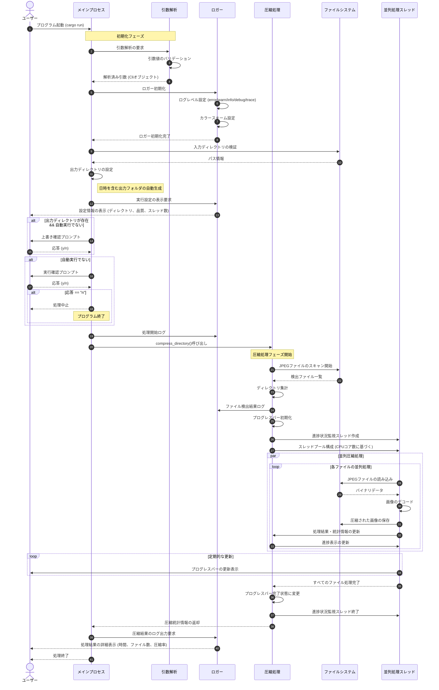

# JPEG 圧縮ユーティリティ

このツールは、ディレクトリ内の JPEG 画像を高速に圧縮し、ディレクトリ構造を維持しながら出力するユーティリティです。Python の`jpeg_compressor`を Rust で再実装したもので、パフォーマンスと安全性が向上しています。

## 主な機能

- マルチスレッド並列処理による高速圧縮
- 進捗状況のリアルタイム表示（プログレスバー）
- 品質レベル指定（1-100）
- mozjpegとimage（標準）の両方のエンコーダーをサポート
- ディレクトリ構造の保持
- 詳細な統計情報の出力
- 圧縮前後のファイルサイズ比較
- 色付きログ出力

## 使用方法

```bash
# 基本的な使用法
cargo run --release -- --input-dir="../data/受領画像_整理済み" --quality=85

# mozjpegエンコーダーを指定する場合
cargo run --release -- --input-dir="../data/受領画像_整理済み" --quality=85 --encoder=mozjpeg

# imageエンコーダーを強制的に使用する場合
cargo run --release -- --input-dir="../data/受領画像_整理済み" --quality=85 --encoder=image

# ヘルプを表示
cargo run --release -- --help
```

### コマンドライン引数

```
Usage: jpeg_compressor [OPTIONS]

Options:
  -i, --input-dir <INPUT_DIR>    入力ディレクトリのパス [default: ../data/受領画像_整理済み]
  -o, --output-dir <OUTPUT_DIR>  出力ディレクトリのパス
  -q, --quality <QUALITY>        圧縮の品質（1-100） [default: 90]
  -y, --yes                      処理を自動実行（プロンプトなし）
  -t, --threads <THREADS>        並列処理のスレッド数（0=自動） [default: 0]
  -e, --encoder <ENCODER>        エンコーダーの種類 [default: image] [possible values: mozjpeg, image]
  -l, --log-level <LOG_LEVEL>    ログレベル [default: info] [possible values: error, warn, info, debug, trace]
  -h, --help                     Print help
  -V, --version                  Print version
```

## 圧縮品質について

- `100`: 無損失圧縮（最高品質、ファイルサイズは大きい）
- `90`: 高品質（視覚的な違いはほとんどない、適度な圧縮）
- `80-85`: 推奨値（良好な品質と圧縮率のバランス）
- `70-75`: 標準的な Web 用（ファイルサイズ優先）
- `60以下`: 低品質（明らかな画質劣化、小さなファイルサイズ）

## エンコーダーについて

- `mozjpeg`: mozjpegエンコーダーを使用（高品質・高圧縮率、DCT最適化）
- `image`: Rustのimageクレートのエンコーダーを使用（標準的な品質）

mozjpegエンコーダーを使用するには、ビルド時にmozjpegライブラリが必要です。

## ビルド方法

```bash
# リリースビルド（推奨）
cargo build --release

# mozjpegサポートなしでビルド
cargo build --release --no-default-features --features="image-encoder"
```

## 推奨環境

- Rust 1.70.0 以上
- マルチコア CPU（並列処理の恩恵を受けるため）
- mozjpegをサポートするには:
  - Linux: build-essential, cmake, nasm
  - macOS: brew install cmake nasm
  - Windows: CMake, Visual Studio Build Tools, NASM

## シーケンス図


